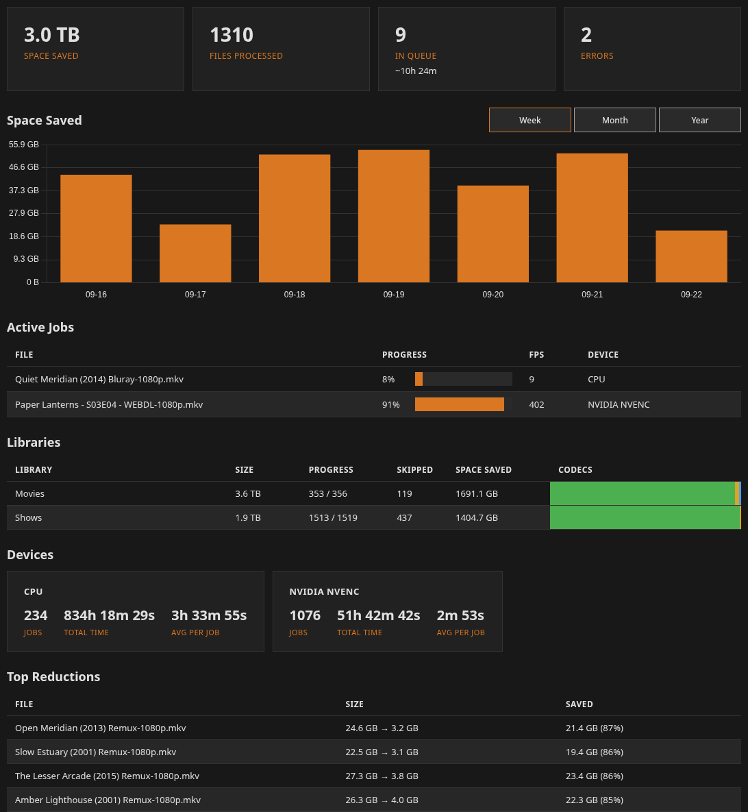

# Undarr

Undarr transcodes media libraries in place to match your quality standards. Select a library and a preset, and it finds the video files, queues them, encodes each one with ffmpeg, checks the result, then replaces the original. It runs as a single container accessed via a web UI.



> [!CAUTION]
> Transcoding is lossy and the original is deleted after a successful job. Test presets on a library of copied files first. Verify that your test library behaves as expected before you move on to your real files.

## Quick start

No image is published yet, so the container is built from a clone of this repository.

```sh
git clone https://github.com/mar-tok/Undarr.git
cd Undarr
```

Edit `docker-compose.yml` so the media volume points at your files, and set `PUID` and `PGID` in `.env` to the owner of those files (copy `.env.example`).

```yaml
services:
  undarr:
    build: .
    container_name: undarr
    restart: unless-stopped
    ports:
      - "6545:6545"
    volumes:
      - ./data:/data
      - ./logs:/logs
      - /path/to/media:/media
    environment:
      - PUID=${PUID:-1000}
      - PGID=${PGID:-1000}
```

```sh
docker compose up -d --build
```

Open `http://localhost:6545`. The quick start page will help you get started.

## Documentation

- [Features](docs/features.md)
- [Hardware encoding](docs/hardware-encoding.md)
- [HDR](docs/hdr.md)
- [Configuration](docs/configuration.md)
- [Tests](docs/tests.md)

## Credits

Icons from [Bootstrap Icons](https://github.com/twbs/icons) and [Feather](https://github.com/feathericons/feather), charts by [Chart.js](https://www.chartjs.org). See `THIRD_PARTY_NOTICES.md`.

## License

AGPL-3.0. See `LICENSE`.
