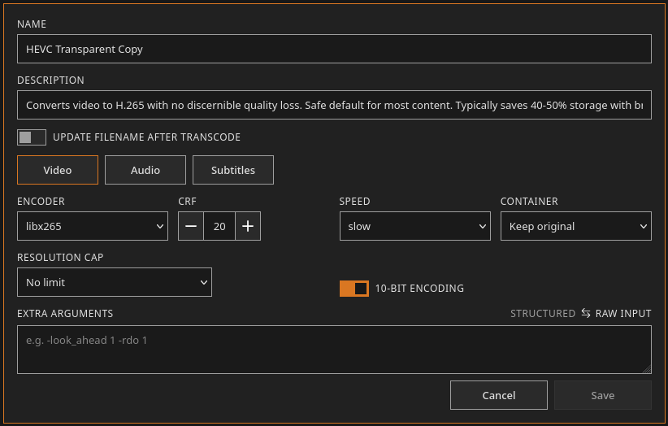
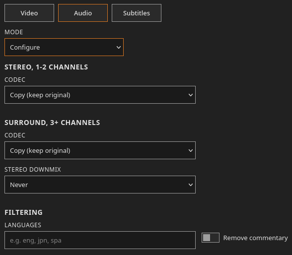
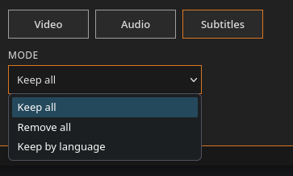
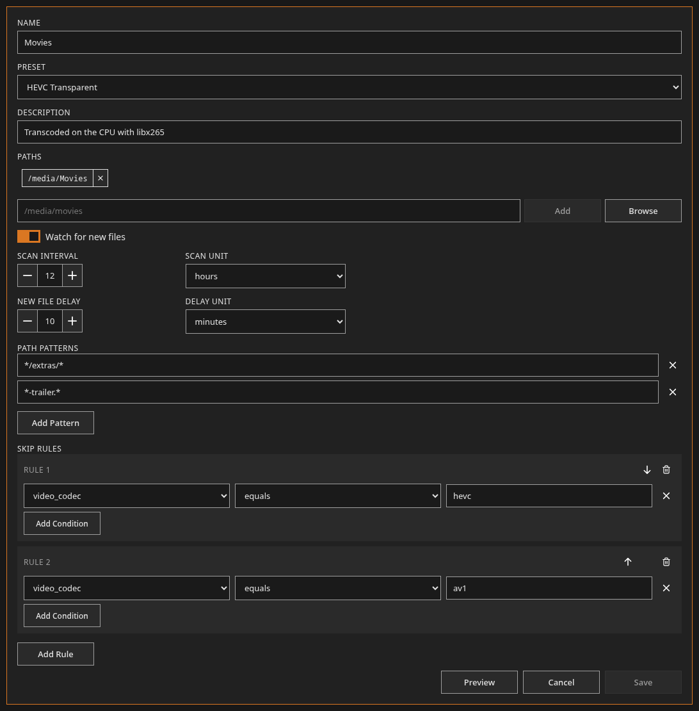
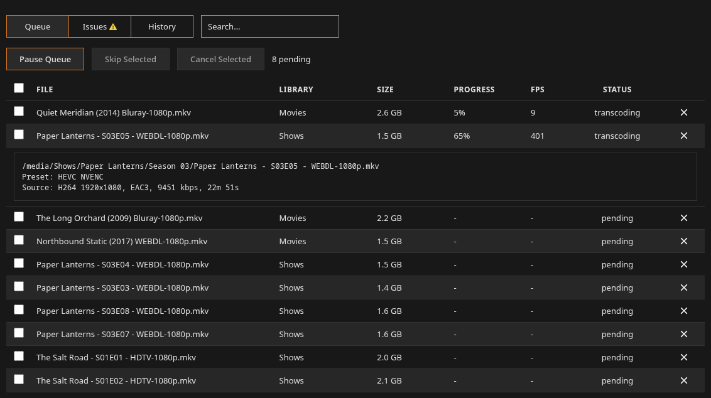
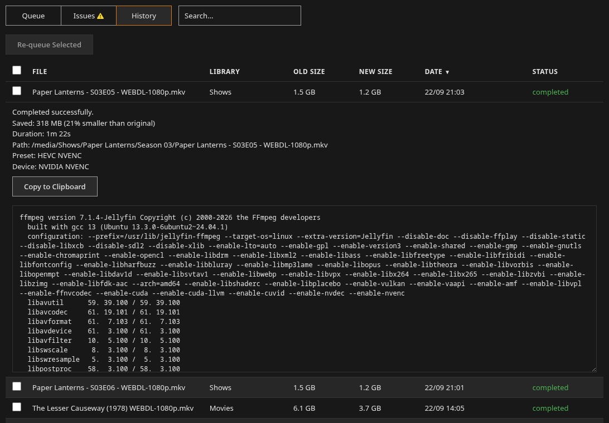
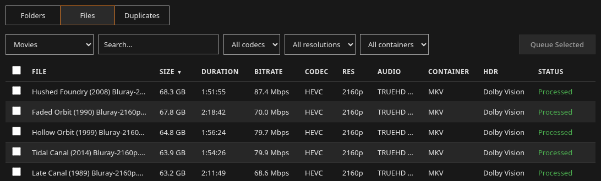
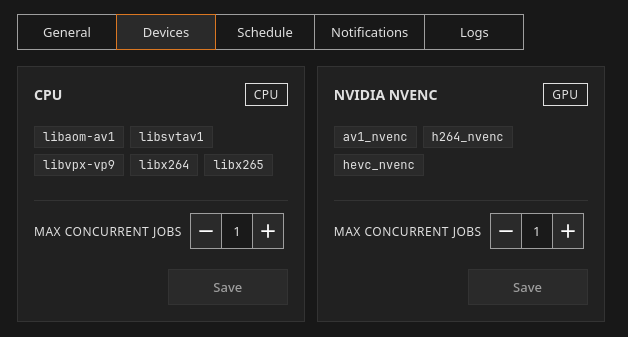
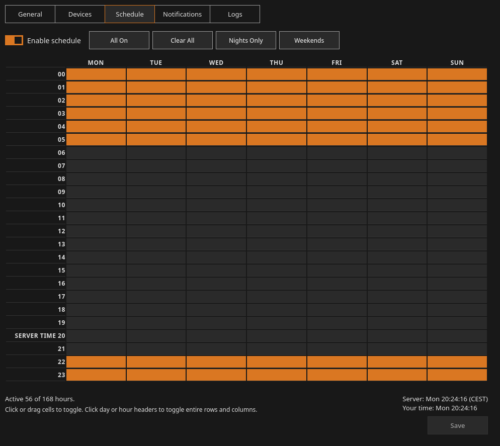
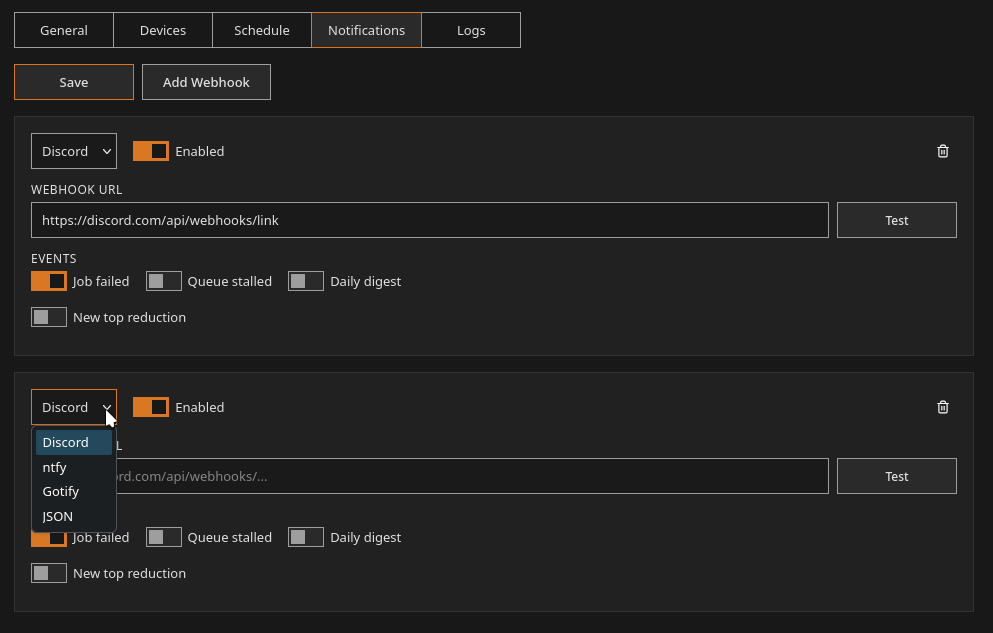

# Features

## Presets

- Four built-in presets named HEVC Transparent, HEVC Space Saver, AV1 Transparent, and AV1 Space Saver
- Custom presets with any ffmpeg arguments
- Output container choice
- The output switches to mp4 when its container cannot hold the new video codec
- Separate audio settings for stereo and surround tracks, and a track that already has the target codec at or below the target bitrate is copied instead of re-encoded
- Audio language filter, commentary removal, and an optional stereo downmix
- Subtitles kept, dropped, or filtered by language with commentary removal
- Resolution cap
- 10-bit output control
- File name update after the transcode, so video codec, audio codec, and resolution tokens in the name match the new file. The tokens are fixed and cannot be customized at this time

## Libraries

- One or more paths per library, with a preset assigned
- Filesystem watcher for new files, with a configurable delay before a new file is queued
- Periodic rescan on an interval
- Skip rules on video codec, audio codec, width, height, bitrate, file size, duration, and HDR type
- Path patterns (globs) that exclude matching files, such as trailers or an Extras folder
- Preview of the files the current settings would queue, before saving
- Pause and resume per library
- Finished files are marked as processed. A processed file counts as new again when its modification time changes. A processed file that is renamed stays processed. Undarr detects the rename when the old path is gone and the file at the new path has the same size, video codec, and duration
- Mark existing files as processed so only new files get queued
- A library whose paths are all missing, such as an unmounted drive, is marked unavailable and starts no jobs. Its file records are kept

## Queue

- Live percentage and frames per second for each running job, and an estimated time until the queue is empty on the overview
- Pause and resume the whole queue
- Cancel, skip, and retry jobs, alone or in batches
- Processing order by arrival (first in, first out), largest file first, or highest bitrate first
- Encoder process priority set to normal, low, or lowest
- Early stop when the estimated output size passes the configured ratio of the source size
- Stall detection when ffmpeg makes no progress
- Issues tab for failed jobs

## Verification

- After ffmpeg exits, the output has to be under the configured size ratio, readable by ffprobe, have a video stream, and match the source duration
- The original is replaced only after every check passes
- A failed job leaves the original untouched and shows the reason and the ffmpeg log

## History

- Every finished job has its ffmpeg log
- Status filter, and a search box that covers queued jobs and history
- Re-queue, alone or in batches

## Overview

- Totals, active jobs, and progress for each library
- Distribution of each video codec in each library, space saved chart
- Top jobs with the largest size reduction, by percentage
- Completed jobs, total time, and average time per job for each device

## Storage

- Every scanned file browsable by folder or as a flat table
- Filters on codec, container, and resolution, plus search
- Queue files and folders from the storage view
- Duplicate finder that hashes files of equal size. Deleting of duplicates can be enabled under Settings

## Hardware encoding

- Encoders detected at startup with a test encode, grouped by device
- Concurrent job limit per device
- NVENC and QSV, see [hardware encoding](hardware-encoding.md)

## Scheduling

## Notifications and monitoring

- Webhooks to Discord, ntfy, Gotify, or any JSON endpoint
- Webhook events for a failed job, a stalled queue, a daily digest, and a job that sets a new best size reduction
- Prometheus metrics at `/api/metrics` and a health check at `/api/health`
- Log viewer in Settings with a level filter, search, and download

## Other

- Quick start page on first run
- Update check against GitHub releases every six hours
- HDR type detection, see [HDR](hdr.md)
